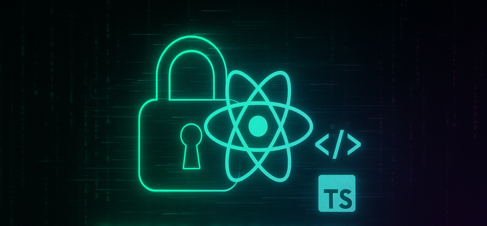

<!--
**erkantokmak/erkantokmak** is a ✨ _special_ ✨ repository because its `README.md` (this file) appears on your GitHub profile.

<!-- ====================================================== -->
<!--    ◼️ 0xERKANTOKMAK — FRONTEND × CYBERSECURITY    -->
<!-- ====================================================== -->

<h1 align="center">
  
   
  <code style="font-size:2.6rem">Erkan TOKMAK</code>
</h1>

    

---

## 🧭 Kısaca Ben
- 🎯 **Frontend Developer** & **Application Security Researcher** 
- 🌐 Uzmanlık alanlarım: **React / Next.js**, **TypeScript**, **CSS/SCSS**, **UI & UX optimizasyonu**  
- 🛡️ Güvenlik tutkum: Web uygulama güvenliği, Bug Bounty
- 🎓 Hedefimdeki sertifika: **OSWE** 
- 🚀 Derinleştiğim konular: **UI/UX tasarım prensipleri**, **Kullanıcı odaklı tasarım süreçleri**
- 🌟 İlgi duyduğum yeni teknolojiler: **Svelte**, **NodeJs**, 
- 📖 Öğrenmekte olduğum konular: **Node.js**, **Express.js**, ve **Functionless Backend** mimarisi 

---

## ⚙️ Tech-Stack & Araçlar
| Kategori | Stack / Araç |
| --- | --- |
| **🏗️ UI & Framework** |     | 
| **🎨 Style** |       |
| **🔌 State / Data** |    | 
| **🧪 Test** |   |
| **☁️ Cloud** |  (Kendimi geliştirmekteyim) |
| **🔐 Security** |       |

## 📈 GitHub İstatistikleri
|  |  |
| --- | --- |

## 📫 Bana Ulaşın
  

---

  

